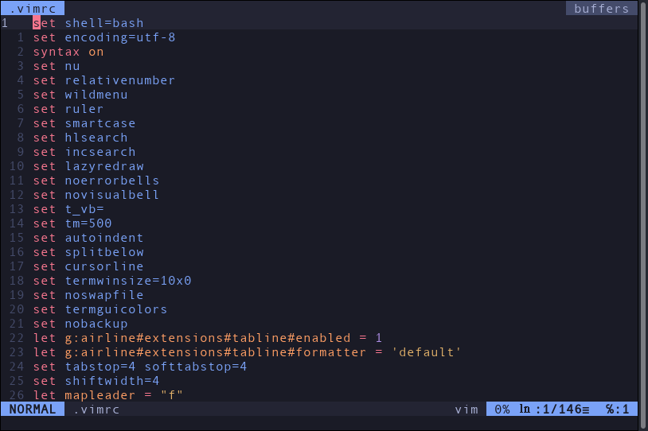

# vimrc
My custom vimrc file



To make sure that my vimrc file works you need to get the NERDTree module.
```
git clone https://github.com/scrooloose/nerdtree.git ~/.vim/pack/vendor/start/nerdtree
vim -u NONE -c "helptags ~/.vim/pack/vendor/start/nerdtree/doc" -c q
```
